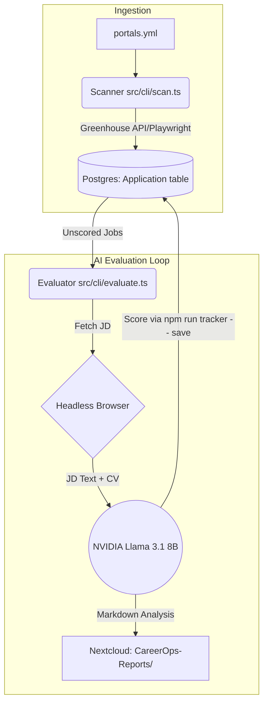

# CareerOps Architecture Overview

The CareerOps ecosystem is designed as a pipeline that bridges automated job scraping, AI-driven candidate evaluation, and durable persistence of applications and reports.

Here is the end-to-end architecture:

## 1. Data Ingestion & Job Boards
*   **Target Definitions (`portals.yml`)**: This file serves as the root index. It contains over 200+ top global and high-growth Indian AI startups, mapped to their specific ATS portals (Greenhouse, Lever, Ashby, etc.).
*   **The Scanner (`src/cli/scan.ts`)**: You run the scanner using `npm run scan`. It parses `portals.yml` and uses a hybrid extraction approach:
    *   **Direct API**: For known ATS boards (Greenhouse, Ashby, Lever), it fetches jobs directly via their undocumented JSON APIs. This is extremely fast and avoids bot-detection.
    *   **Headless Fallback**: For custom job boards, it falls back to Playwright to scrape the DOM.
*   **The Tracker (Postgres `Application` table)**: The scanner normalizes all discovered jobs and persists them as new rows in Postgres via the tracker CLI (`npm run tracker -- add`).

## 2. Automated AI Evaluation (The Agent)
*   **The Evaluator (`src/cli/evaluate.ts`)**: You trigger this via `npm run evaluate`.
*   **Playwright Extraction**: For every "shortlisted" job in the tracker that doesn't have a score, the agent spins up a headless browser, navigates to the job URL, and extracts the raw Job Description text.
*   **Inference Gateway**: The agent constructs a massive prompt containing the Job Description, your CV (`cv.md`), and the strict 6-block scoring criteria (`modes/oferta.md`). It routes this payload to an OpenAI-compatible provider (like `build.nvidia.com` or `opencode.ai`).
*   **Score & Reporting**: The LLM acts as an autonomous recruiter. It scores your profile against the job (from 0 to 5.0) and generates a detailed markdown report outlining your strengths, missing skills, and interview prep.
*   **Ledger Update**: The script persists the run via `npm run tracker -- save`, which uploads the report to Nextcloud (WebDAV folder `CareerOps-Reports/`) and inserts the corresponding row (including the final score) into the Postgres `Application` table.

## 3. Persistence Layer
*   **Postgres (`Application` table)**: Application records — company, role, status, score, and report link — are stored in Postgres via Prisma. Query them with `npm run tracker -- list`.
*   **Nextcloud (`CareerOps-Reports/`)**: Generated markdown evaluation reports are uploaded to Nextcloud over WebDAV, keeping them durable and accessible across machines.
*   **Tracker CLI**: All persistence flows through `npm run tracker -- save|add|update|list` (see `src/cli/tracker.ts`). `save` writes both the Nextcloud report and the Postgres row in one step; `update` records status changes.

## Architecture Diagram

