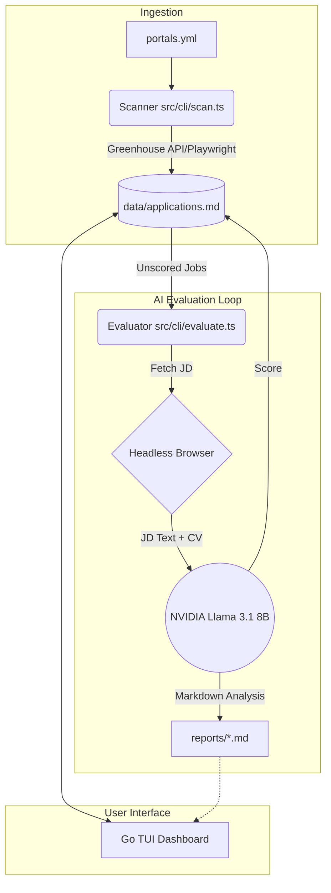

# CareerOps Architecture Overview

The CareerOps ecosystem is designed as a pipeline that bridges automated job scraping, AI-driven candidate evaluation, and a terminal-based user interface for tracking.

Here is the end-to-end architecture:

## 1. Data Ingestion & Job Boards
*   **Target Definitions (`portals.yml`)**: This file serves as the root index. It contains over 200+ top global and high-growth Indian AI startups, mapped to their specific ATS portals (Greenhouse, Lever, Ashby, etc.).
*   **The Scanner (`src/cli/scan.ts`)**: You run the scanner using `npm run scan`. It parses `portals.yml` and uses a hybrid extraction approach:
    *   **Direct API**: For known ATS boards (Greenhouse, Ashby, Lever), it fetches jobs directly via their undocumented JSON APIs. This is extremely fast and avoids bot-detection.
    *   **Headless Fallback**: For custom job boards, it falls back to Playwright to scrape the DOM.
*   **The Tracker (`data/applications.md`)**: The scanner normalizes all discovered jobs and writes them as new markdown table rows into this central ledger.

## 2. Automated AI Evaluation (The Agent)
*   **The Evaluator (`src/cli/evaluate.ts`)**: You trigger this via `npm run evaluate`.
*   **Playwright Extraction**: For every "shortlisted" job in the tracker that doesn't have a score, the agent spins up a headless browser, navigates to the job URL, and extracts the raw Job Description text.
*   **Inference Gateway**: The agent constructs a massive prompt containing the Job Description, your CV (`cv.md`), and the strict 6-block scoring criteria (`modes/oferta.md`). It routes this payload to an OpenAI-compatible provider (like `build.nvidia.com` or `opencode.ai`).
*   **Score & Reporting**: The LLM acts as an autonomous recruiter. It scores your profile against the job (from 0 to 5.0) and generates a detailed markdown report outlining your strengths, missing skills, and interview prep.
*   **Ledger Update**: The script saves the report to `/reports/` and edits the `data/applications.md` table to inject the final score in real-time.

## 3. The Interactive Dashboard
*   **Go TUI (`dashboard/main.go`)**: While the Node.js scripts handle data processing, the Golang dashboard provides the interface.
*   **Bubbletea Framework**: Built on Charmbracelet's `bubbletea`, the dashboard reads `data/applications.md` and renders an interactive, Vim-style terminal UI.
*   **Workflow Integration**: As the Node.js evaluation agent updates scores in the background, the Go dashboard immediately reflects those scores in the terminal, allowing you to filter, sort, and manage your pipeline visually without ever leaving the terminal.

## Architecture Diagram

